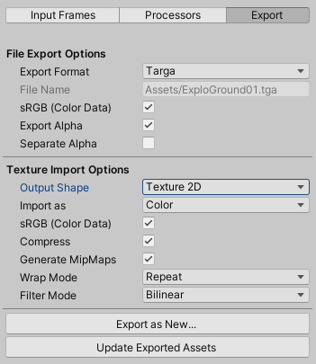

# Image Sequencer


## Introduction
The VFX Image Sequencer is a tool which provide Visual Effect Artists with the means to process sequences of images, and generate texture assets such as flipbooks texture sheets. 


To edit sequences of images, the tool relies on **Image Sequence assets**. These template assets contain references to project imported textures, a set of processing settings, and an export configuration. Every asset can be considered as a “Project File” in order to generate one output texture file or a sequence of these.

## Quick Start Guide

Image Sequence Assets can be created from the Project Window Create Menu under the Category VFX Toolbox. Each asset contains configuration to read a sequence of images and output one or a sequence of textures.

These assets can be considered as a “Project Template” for producing flipbook texture sheets, so you can retain the settings and iterate on them for future updates.

### Creating Image Sequences

Image Sequences are assets that can be created using the main Menu : **Assets/Create/Visual Effects/Image Sequence**. Every Image Sequence asset contains a "Project Template" to create a Texture Sheet.

### Opening Image Sequences

The Image sequencer window is the main editor of Image Sequence assets. You can open this window :

* By clicking the **Window/Visual Effects/Image Sequencer** menu item
* By clicking the **Edit Sequence** button
* By double-clicking an Image Sequence asset in the Project Window.

While the Image Sequencer window is open, selecting another image sequence in the project window will load it in the Image Sequencer window.

### Editing Image Sequences

Once created, the Image Sequence can be edited in the Image Sequencer using the following actions:

1. Adding Input Frames
2. Add and Edit Processors to alter the source image sequence.
3. Export the Output of the Processors as one or many Images

In order to switch between these actions, you can use the 3 tabs located at the top of the left inspector pane:


If no images are not imported, the Processors and Export tabs are disabled and cannot be clicked.

#### Adding Input Frames


You can import images in the sequence by clicking the **Input Frames** tab Button to enter Input Frames editing mode then by dragging them directly from the Project Window to the Image Sequencer window, or by dragging a folder that contains images from the Project Window to the Image Sequencer Window

> For more information, see the Input Frames Workflow section of this document.
>

#### Adding and Editing Processors


After adding Input Frames, by clicking the Processors Tab button, you can enter the Processors editing Mode. In this view you can add processors in the reorderable list, edit them and iterate to generate texture sheets. 

In this mode you will be able to perform operations on textures such as Assembling and Disassembling Texture Sheets, Adjusting Timing of a Sequence, Make an image Sequence looping, Crop images to save empty space, Fix borders, adjust Colors, and many more actions.

> For more information, see the Processors Workflow  section of this document.
>

#### Exporting Images



After Adding Processors, when you have a result that suits you, you can click the third Tab Button "Export" to enter Export Mode. In this mode you can configure the texture generation options and also the texture import options. 

In this view you will be able to set up your output textures either as color, masks or normal maps and ensure they are exported correctly.

> For more information, see the Export Workflow section of this document.
>

## Image Sequence Inspector


Upon selecting an Image Sequence Asset, the inspector displays an overview of this asset, with its input frames, processors overview, and optionally the Exported file (if any). This is only a read-only overview of the processing information of this sequence. 

- To edit this sequence, click the **Edit Sequence** button, this will open the Image Sequencer Editor Window.
- You can preview input sequence of images by clicking the preview button.

## Image Sequencer Window


The Image Sequence editor window comes with two zones: 

* The **Toolbar** at the top provides controls to access the currently edited Image sequence, and display controls for the Canvas.
* The **Inspector** (left pane) displays contextual controls for adding input frames, configure processing, and export to other textures.
* The **Canvas** (right pane) offers preview of the processed sequence at different stages (input sequence, processors, exported texture). It contains play controls at the bottom, view options in the top toolbar, and handles panning and zooming using mouse.

### Inspector

The inspector lies in the left part of the window and is the part of the window where you will make changes to the Image Sequence. At the top of the inspector lies a 3-Button tab in order to switch between the editing modes : Input Frames, Processors and Export.


### Canvas

The canvas is in the right side of the window and is used to preview the changes made in the Image Sequencer Inspector. It displays contextually either the Input Frames, the output of a processor, or the exported texture.

Navigation in the canvas is made by using the mouse or trackpad. 

Some keyboard shortcuts enable access to same features accessible with the mouse:

* Alt+Left Mouse Drag : Pan the viewport

* Middle Mouse Drag : Pan the viewport

* Alt+Right Mouse Drag : Zoom the viewport

* Mouse Wheel : Zoom the viewport

Some keyboard shortcuts enable focusing on the image:

* F focuses the image, fitting the zoom to fill the viewport
* Shift + F focuses the image, with a 100% zoom

(Note that these controls are available in the options popup menu)

### Sequence Playback Controls 

Playback controls are visible when your sequence contains 2 or more images. They are available as a bottom panel.
  

The sequence playback panel contains a timeline track showing the current progress of the timeline. 

Every frame is displayed in the track as a colored cell:

* Bright blue cell displays the currently selected (displayed) frame in the canvas.

* Blue darker cells tells that these frames have already been rendered.

* Gray cells mean frames have not already been rendered

> (You can enable automatic rendering by activating the AutoCook Option in the options menu)

Here is an overview of the Toolbar located under the sequence trackbar

* **Playback Buttons** 
  * First Frame
  * Previous Frame
  * Play/Pause
  * Next Frame
  * Last Frame
* **Image & Sequence information**
  * Frame N on Total Count
  * TCR time (based on frame rate)
* **Speed and Framerate Control**
  * Number of frames per second
  * Popup to set a given play rate

### Viewport Toolbar 

The viewport toolbar contains controls for toggle display of various options in the viewport.


The toolbar contains the following elements:

* **Options Popup Menu**: Opens the Option popup menu to configure the Canvas display options.
* **RGBA toggles** : Use these buttons to filter the Red, Green, Blue or Alpha channel display.
* **MipMap Selector** : Using this slider, you can preview the different mip-maps of the currently displayed image.
* **Background brightness**: Using this slider, you can adjust the background checkerboard brightness.

#### Options popup menu


The Options popup menu is accessed via the toolbar button on the right.It contains toggles & buttons for visibility, and commands for the view.

* Viewport Options:
  * Grid Outline (Toggle) : Toggles Outline around Sub Image Cells and around texture.
  * Frame Processor Overlays (Toggle) : Toggle Processor Overlay in the canvas to display visually its changes.
  * Texture Filtering (Toggle) : Toggles Texture Filtering in the Canvas

### Update Button


## Workflow

This section details how to use the Image Sequencer and create output Texture Sheets. The workflow for a new Image Sequence is as follows:

1. Import and Configure Source Images
2. Create Image Sequence Asset and Open It
3. Adding input frames into the Image Sequence
4. Add Processors and Build your Texture Sheets
5. Export the output sequence as one or many textures.

After the first iteration on an Image sequence Asset, you can open this sequence later, make adjustments, then update your output image in one click using the **Update Button** in the canvas

### Importing and Configuring source images

Your source images will be imported inside the project for full efficiency, but they do not have to be used in your project. These textures will behave as intermediate sources for generating assets, so It could be a good Idea to use asset labels to filter them in order to ensure they are isolated and unused.

#### Manual settings

Texture configuration for the source images answers the “lossless quality” requirement : at this stage of workflow, you do not want to degrade quality, so importing your textures at maximum quality is required here. 
In order to stay at lossless quality, make sure you have the following:

- Keep your textures uncompressed : 
  - Use Compression : None
- Ensure your texture will not be resized if too large: 
  - Advanced/Non-Power of Two : None
  - Max Size : 8192
- Ensure your alpha channel will not be modified by the importer:
  - Disable the Alpha Is Transparency (if available)
- Ensure the sRGB flag matches your image contents:
  - sRGB on for any 8-bit per component Color Image
  - sRGB off for:
    - Any HDR Image (exr)
    - Flow Maps, Normal Maps, Bump Maps and/or masks

#### Asset Postprocessor

It is advised to use an [AssetPostprocessor](https://docs.unity3d.com/ScriptReference/AssetPostprocessor.html) to ensure all your sources are configured correctly. Here is an example of one that would add a VFX and source label and Configure all textures within the Asset/Resources/ folder, with the same settings except disable sRGB for exr and textures with the **_nrm** nomenclature in their filename, or **_lin** nomenclature for forcing non sRGB.
You can find this default example that you can modify to fit your needs at the following path of the project: 

```C#
using System.IO;

namespace UnityEditor.VFXToolbox
{
    public class ImageSequencerSourcePostprocessor : AssetPostprocessor
    {
        // Internal flags for usage
        public enum Usage
        {
            Color,
            LinearData
        }
        
        public const string m_RootFolder = "Assets/VFXResources";
        public const string m_NormalNomenclaturePostFix = "_nrm";
        public const string m_LinearNomenclatureSuffix = "_lin";
        public const string m_OpticalFlowNomenclatureSuffix = "_of";
        public readonly string[] m_Labels = new string[] { "Weapon", "Audio" };
        
        void OnPreprocessTexture()
        {
            if (assetPath.StartsWith(m_RootFolder)) // for all assets in VFX resources folder
            {
                string filename = Path.GetFileName(assetPath);
                string extension = Path.GetExtension(assetPath);

                // Default usage is color
                Usage usage = Usage.Color;

                // if containing normal suffix, switch to linear
                if (filename.ToLower().Contains(m_NormalNomenclaturePostFix.ToLower()))
                    usage = Usage.LinearData;

                // if containing linear suffix, switch to linear
                if (filename.ToLower().Contains(m_LinearNomenclatureSuffix.ToLower()))
                    usage = Usage.LinearData;

                // if containing opticalflow suffix, switch to linear
                if (filename.ToLower().Contains(m_OpticalFlowNomenclatureSuffix.ToLower()))
                    usage = Usage.LinearData;

                // if HDR, switch to linear
                if(extension.ToLower() == "EXR".ToLower())
                    usage = Usage.LinearData;

                TextureImporter importer = (TextureImporter)assetImporter;

                // Even if we have normalmaps, we don't want to encode them in swizzled NM yet.
                importer.textureType = TextureImporterType.Default;

                switch(usage)
                {
                    default: // Color, but should not happen
                    case Usage.Color:
                        importer.sRGBTexture = true;
                        break;
                    case Usage.LinearData:
                        importer.sRGBTexture = false;
                        break;
                }

                importer.alphaSource = TextureImporterAlphaSource.FromInput;
                importer.alphaIsTransparency = false;
                importer.maxTextureSize = 8192;
                importer.mipmapEnabled = true;
                importer.mipmapFilter = TextureImporterMipFilter.KaiserFilter;
                importer.npotScale = TextureImporterNPOTScale.None;
                importer.textureShape = TextureImporterShape.Texture2D;
                importer.textureCompression = TextureImporterCompression.Uncompressed;

            }
        }
    }
}

```

Here are some guidelines for handling various situations when your source image changes:

- Source file changes: In order to update these sources (i.e. you make changes inside your 3D VFX package and render your frames again), just overwrite the files. Source sequence length increases: If your sequence length ever changes, you will have to manually adjust your sequence length. A safe way to do this is to remove all the frames in the input sequence by clearing the list, then drag and drop the folder again.
- Source sequence length decreases: this corner case is not yet automatically addressed so you will have to manually trim the exceeding frames by deleting them in the project view. (or use a post-render script in your 3D Package to remove the files and the meta files)

### Creating an Image Sequence

You can create image sequences using the Create Asset Menu:

- From the main Menu : **Assets/Create/Visual Effects/Image Sequence**
- From the main Project Window + Menu : **Visual Effects/Image Sequence**


After Clicking the item in the menu, enter the name of your Image Sequence asset in the Project View, then press Return key to validate.

Alternatively, When the Image Sequencer window is opened with no asset selected (eg: when  opened from the menu), the Image Sequencer Window displays a message that informs that no Asset is selected, and provides the option to Create an image sequence from a button. When clicked, you can save a file for your new asset.


#### Editing an Image Sequence asset

After Creating the Image Sequence, you can either:

* Double click its icon in the Project Window
* Click its Edit Sequence button at the top of the Unity Inspector
* Just select this asset while having the Image Sequencer window open.

### Input Frames

The first operation you need to do when working on an Image Sequence asset is to add Input Images to this sequence. These Images need to be already imported into your project and it is advised that they have particular settings in order to keep them as maximum quality. (See Importing and Configuring Source images)


You can import images in the sequence by clicking the Input Frames tab Button to enter Input Frames editing mode then : 

- By dragging them directly from the Project Window to the Image Sequencer window
- By dragging a folder that contains images from the Project Window to the Image Sequencer Window
- By selecting textures in the Project Window and clicking the plus button at the bottom of the reorderable list.

After importing, Images can be added, reordered, deleted, and using the popup menu, you can also perform actions such as sorting alphabetically. The Actions Popup Button offers you the following menu options:

* Clear : Removes all the elements in the Input Frames List
* Sort All : Sorts all elements in the input frames list alphabetically
* Reverse Order : Reverses the order of all elements in the Input Frames list

### Processors

After adding Input Frames to the Image Sequence, you can go into Processor Editing mode. To do so, click the Processors Tab Button at the top of the Left pane.

#### Processor Mode Inspector

When entering Processor mode, the left pane inspector changes and presents the following information:


**Clear (Button) :** Clears the current list of frame processors (if not inheriting from another asset.)


**Frame Processors (Reorderable List) :** The list of currently used processors.

* If a frame processor is selected, below the list of processor list will appear the processor inspector.
* You can reorder processors by dragging them upwards or downwards in the list.
* You can enable or disable processors by clicking the toggle at the left of the Processor Title

#### Adding Processors

In order to add processors to the list, click the **+** button located at the bottom of the Processors List. Clicking the button opens the Processor Add Menu.


You can use the Input Search Field at the top to filter and refine processors, or navigate the categories by clicking the items, and finally add the processor you want by clicking it in the list.

#### Removing Processors

You can remove processor using the following :

* Select a processor in the list then click the "-" button located at the bottom of the Processor List.
* Click the Clear button to remove all processors at once.

#### Editing Processors

Upon Selecting a Processor in the list, it displays its properties below the Processors list. You can then edit these properties to modify its behavior.

#### Adjusting Processor Visibility


Upon Selecting a processor in the list, it becomes previewed automatically in the viewport. You can check its visibility by looking at the **eye icon** located in the right part of the processor item in the Processors Reorderable List.


You can **lock** or **unlock** the preview of a certain processor by toggling its lock icon, located in the far right part of the processor item in the Processors Reorderable List.

When in **locked preview state**, you can still select and edit other processors to preview the changes on the currently locked processor view.

#### Inheriting Processors and Settings from other Image Sequences

#### 

**Inherit Processors From (Image Sequence Asset) :** When using an Image Sequence asset in this field, the whole processor stack becomes overridden by the same processors and their configuration stored into the other asset. When inheriting, you cannot edit these values, except in the Asset that defined them.

### Exporting the Image Sequence

After working on an image sequence, and adding processors, you will end up in a state where you want to generate a texture out of the result of this image sequence. 

## Built-In Processors

This section details the built-in processors bundled with Image Sequencer and their behavior.

### Main Category

#### Custom Material

Custom Material Processor enables using custom materials to process Frames. Custom Materials enable performing operations on a frame's pixels using a shader.

When using a Custom Material processor, the following inspector is displayed:


The **material** field references a material in the project, for use with this processor. When a material is selected, it displays its inspector below the material field.

You can adjust material properties directly in this inspector.

> Note: Materials you edit in the inspector are edited directly in the asset so they can share their settings across various Image Sequences.

To write shaders compatible with Image Sequencer, see the [Custom Material Shader](#writing-shaders-for-custom-material-processor) documentation.


### Color

#### Alpha From RGB

Alpha from RGB Processor generates an alpha channel value based on luminance values stored in the RGB channels of the input frames.

When using an Alpha from RGB processor, the following inspector is displayed:


**Color Filter** : A color to apply as a tint before converting the RGB values to Grayscale.

#### Color Correction

The Color Correction processor applies Brightness, Contrast and Saturation control over the input Frames, as well as Alpha  Remapping.

When using an Alpha from RGB processor, the following inspector is displayed:


* **Brightness** : Controls image Brightnness
* **Contrast** : Control Image Contrast
* **Saturation** : Control Image Color Saturation
* **Alpha** Curve : Remaps the Alpha Output Range based on the input Alpha values

#### Pre-multiply Alpha

The Pre-Multiply Alpha Processor applies a simple Alpha mask on RGB values to ensure RGB values are pre-multiplied by the alpha channel. This process is often required to use your textures in pre-multiplied alpha blend mode.

When using an Pre-Multiply Alpha processor, the following inspector is displayed:


* **Remove Alpha** (Toggle) : Replaces the alpha channel by a solid opacity
* **Alpha Value** (Float) : The solid opacity value to apply if Remove Alpha is enabled.

#### Remap Color

The Remap Color Processor remaps the output color based on a single grayscale value. This process is quite similar to Photoshop's Gradient Map filter.


#### Remove Background


### Common

#### Crop


#### Fix Borders


#### Resize


#### Rotate


### Sequence

#### Decimate


#### Fade


#### Loop Sequence


#### Retime


### Texture Sheet

#### Assemble Flipbook


#### Break Flipbook


### Writing Shaders for Custom Material Processor

### Writing Custom Processors


